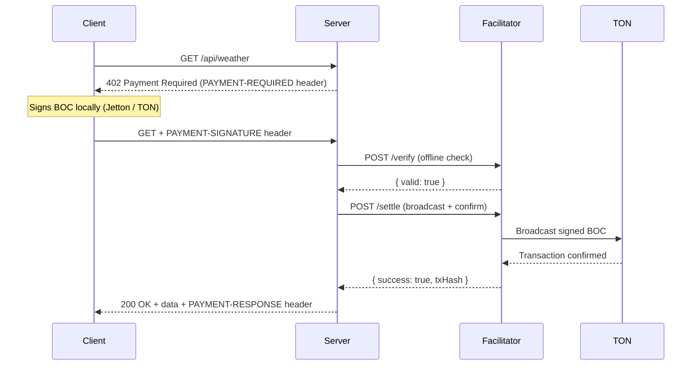

# BSA x TON - Stablecoins & Payments Hackathon Starter

Welcome to the [BSA](https://bsaepfl.ch/) x [TON](https://ton.org/) **Stablecoins & Payments Hackathon** official starter kit!

This starter was built by BSA members [Stan](https://github.com/hliosone) and [Loris](https://github.com/Loris-EPFL), feel free to reach out to Loris only for questions, bug reports, or anything else.

The goal of this kit is to give you a **fully working pay-per-use API infrastructure** out of the box if you planned to use x402 with TON (you can of course build anything you want), so you can focus on building your product instead of plumbing payment logic. It implements the **x402 protocol** (HTTP 402 Payment Required) on the **TON blockchain**, using **BSA USD** (our testnet stablecoin) as the payment token (TON token is also supported).

---

## Tech Stack

This starter is a **pnpm monorepo** built with:

- [TypeScript](https://www.typescriptlang.org/) for everything
- [Next.js 15](https://nextjs.org/) for the example server (App Router)
- [TON SDK](https://github.com/ton-org/ton) (`@ton/ton`, `@ton/core`, `@ton/crypto`) for blockchain interactions
- [pnpm](https://pnpm.io/) for package management
- **BSA USD** - our TEP-74 Jetton stablecoin deployed on TON testnet

---

## Project Structure

```
ton-x402-hackathon-starter/
├── packages/
│   ├── core/           # Shared types, protocol headers, encoding utils
│   ├── client/         # x402Fetch - drop-in fetch wrapper that handles the payment flow
│   ├── middleware/     # paymentGate - wraps any Next.js route handler with payment logic
│   └── facilitator/    # BOC verification + on-chain settlement (broadcast + poll)
│
└── examples/
    ├── nextjs-server/  # Full Next.js app with paid routes + built-in facilitator endpoints
    └── client-script/  # CLI script to test payments end-to-end
```

### Packages at a glance

> These four packages were built from scratch by Stan and Loris specifically for this hackathon starter. They are not published on npm, they live in `packages/` and are linked locally via pnpm workspaces. You can read, extend, or fork them freely.

| Package | What it does |
|---|---|
| `@ton-x402/core` | Protocol types (`PaymentRequired`, `PaymentPayload`, `SettlementResponse`), header encode/decode, TON utilities |
| `@ton-x402/client` | `x402Fetch(url, config)` - wraps native `fetch`, auto-handles the 402 -> sign -> retry flow |
| `@ton-x402/middleware` | `paymentGate(handler, { config })` - wraps a Next.js route handler, adding payment verification before calling your code |
| `@ton-x402/facilitator` | `createVerifyHandler` / `createSettleHandler` - HTTP handlers for the facilitator API, which verifies BOCs offline and broadcasts on-chain |

---

## Quickstart

### Prerequisites

**To run the server** (required for everyone):
- [Node.js](https://nodejs.org/) >= 18
- [pnpm](https://pnpm.io/) - install with `npm i -g pnpm`
- A Toncenter API key (free at [toncenter.com](https://toncenter.com))
- A TON wallet address to receive payments (just the address, no mnemonic needed server-side)

**To run our client test scripts** (`pnpm dev:client`, `pnpm dev:client:joke`) - optional:
- A TON testnet wallet with its 24-word mnemonic (e.g. Tonkeeper, switch to testnet mode)
- Testnet TON (for gas) and testnet BSA USD (for payments) on that wallet

### 1. Clone the repo

```bash
git clone git@github.com:bsaepfl/bsa-sp-template-x402-2026.git
cd bsa-sp-template-x402-2026
```

### 2. Install dependencies and build packages

```bash
pnpm install
pnpm build
```

### 3. Configure the environment

```bash
cd examples/nextjs-server
cp .env.example .env.local
```

Open `.env.local` and fill in your values:

```env
# TON network: "testnet" or "mainnet"
TON_NETWORK=testnet

# Your wallet address - this is where your server receives payments
PAYMENT_ADDRESS=your_ton_wallet_address_here

# BSA USD Jetton master contract on TON testnet (pre-filled)
JETTON_MASTER_ADDRESS=kQCd6G7c_HUBkgwtmGzpdqvHIQoNkYOEE0kSWoc5v57hPPnW

# Facilitator URL - the Next.js app ships a built-in facilitator at /api/facilitator
FACILITATOR_URL=http://localhost:3000/api/facilitator
#FACILITATOR_URL=https://ton-x402-nextjs-server-lqa1jowhn-hliosones-projects.vercel.app/api/facilitator

# Toncenter RPC (get a free API key at https://toncenter.com)
TON_RPC_URL=https://testnet.toncenter.com/api/v2/jsonRPC
RPC_API_KEY=your_toncenter_api_key_here

# 24-word mnemonic of the wallet used by the client-script examples to PAY endpoints
# Only needed to run pnpm dev:client / pnpm dev:client:joke - not used by the server at all
WALLET_MNEMONIC="word1 word2 word3 ... word24"
```

> **Note on `PAYMENT_ADDRESS` vs `WALLET_MNEMONIC`:** `PAYMENT_ADDRESS` is just an address - it's where your server *receives* payments, and the server never needs the private key. `WALLET_MNEMONIC` is the 24-word seed of the *client* wallet that *sends* payments, and is only used by our test scripts in `examples/client-script/`. If you're building your own client, you won't need `WALLET_MNEMONIC` at all - just implement the same signing logic with your own wallet setup.

### 4. Get testnet funds (only needed to run the client test scripts)

If you want to run `pnpm dev:client` or `pnpm dev:client:joke` to test payments end-to-end, the wallet from your `WALLET_MNEMONIC` needs:

**Testnet TON** (for gas fees):
- Use the Telegram bot [@testgiver_ton_bot](https://t.me/testgiver_ton_bot) to get free testnet TON

**Testnet BSA USD** (the payment token):
- Use our [BSA USD faucet](https://ton-x402-nextjs-server-dyvpwctew-hliosones-projects.vercel.app/) to receive BSA USD on TON testnet

> If you're only running the server and building your own client, you can skip this step.

### 5. Start the server

From the **repo root**:

```bash
pnpm dev
```

This starts the Next.js dev server at `http://localhost:3000`. Visit it to see a landing page explaining the protocol and a quickstart guide.

### 6. Test a payment end-to-end

In a separate terminal, still from the **repo root**:

```bash
# Pay for weather data (0.01 BSA USD)
pnpm dev:client

# Pay for a developer joke (0.01 BSA USD)
pnpm dev:client:joke
```

You should see output like:

```
💰 Wallet: 0QA...
💎 Balance: 12.5 TON
🔢 Seqno: 3

🌐 Requesting: http://localhost:3000/api/weather
💸 Payment required: 1.0 BSA USD
🪙 Asset: Jetton (kQCd6G7...)
📍 Pay to: EQB...
🌐 Network: testnet

🔐 Signing payment: 1.0 BSA USD to EQB...
✅ Payment confirmed!
📝 TX Hash: 8f3a...
🌐 Network: testnet

📦 Resource data:
{
  "location": "Lausanne, Switzerland",
  "temperature": 22,
  ...
}
```

---

## Adding a Paid Route to Your App

This is the core of what you'll be doing during the hackathon. It takes **3 lines** to protect any API route.

### Server side

Create `app/api/my-endpoint/route.ts`:

```typescript
import { paymentGate } from "@ton-x402/middleware";
import { getPaymentConfig } from "../../../lib/payment-config";

const handler = (_request: Request) => {
    return Response.json({ secret: "Here is your premium data!" });
};

export const GET = paymentGate(handler, {
    config: getPaymentConfig({
        amount: "10000000",  // 0.01 BSA USD (9 decimals)
        asset: process.env.JETTON_MASTER_ADDRESS,
        description: "My premium endpoint (0.01 BSA USD)",
        decimals: 9,
    }),
});
```

That's it. `paymentGate` handles everything:
- Returns `402` with payment instructions if no payment is attached
- Calls the facilitator to verify the signature
- Broadcasts the transaction on-chain and waits for confirmation
- Calls your handler only once payment is confirmed
- Adds the `PAYMENT-RESPONSE` header (with TX hash) to the response

### Client side

```typescript
import { x402Fetch } from "@ton-x402/client";
import { mnemonicToPrivateKey } from "@ton/crypto";
import { WalletContractV5R1, TonClient } from "@ton/ton";

const keypair = await mnemonicToPrivateKey(process.env.WALLET_MNEMONIC!.split(" "));
const wallet = WalletContractV5R1.create({ publicKey: keypair.publicKey, workchain: 0 });
const client = new TonClient({ endpoint: process.env.TON_RPC_URL!, apiKey: process.env.RPC_API_KEY });
const walletContract = client.open(wallet);
const seqno = await walletContract.getSeqno();

const result = await x402Fetch("http://localhost:3000/api/my-endpoint", {
    wallet,
    keypair,
    seqno,
    client,
});

if (result.response.ok) {
    const data = await result.response.json();
    console.log(data); // { secret: "Here is your premium data!" }
    console.log("TX Hash:", result.settlement?.txHash);
}
```

`x402Fetch` is a drop-in replacement for `fetch`. It:
1. Makes the first request
2. If it gets a `402`, builds and signs the payment BOC locally
3. Retries with the `PAYMENT-SIGNATURE` header
4. Returns the final response + settlement info (TX hash, network)

---

## Example API Routes

The starter ships with three working paid endpoints:

| Route | Price | Description |
|---|---|---|
| `GET /api/weather` | 0.01 BSA USD | Dummy weather data for Lausanne |
| `GET /api/joke` | 0.01 BSA USD | Random developer joke |
| `GET /api/premium-content` | 0.01 BSA USD | Generic premium content with a secret code |

Each is protected with `paymentGate` using the BSA USD Jetton. Look at their source in `examples/nextjs-server/app/api/` for reference implementations.

---

## The Facilitator

The **facilitator** is a small HTTP service with two endpoints:

- `POST /verify` - validates the signed BOC offline: checks recipient address, amount, asset type, network. Fast, no on-chain call.
- `POST /settle` - broadcasts the BOC to the TON network and polls for confirmation (up to 60s by default). Returns the TX hash on success.

In this starter, the facilitator **lives inside the Next.js app** at `/api/facilitator/verify` and `/api/facilitator/settle`. This means you don't need to run a separate service - everything is self-contained.

```typescript
// examples/nextjs-server/app/api/facilitator/shared.ts
import { createVerifyHandler, createSettleHandler } from "@ton-x402/facilitator";

const config = {
    tonRpcUrl: process.env.TON_RPC_URL ?? "https://testnet.toncenter.com/api/v2/jsonRPC",
    tonApiKey: process.env.RPC_API_KEY,
};

export const verifyHandler = createVerifyHandler(config);
export const settleHandler = createSettleHandler(config);
```

If you want to deploy the facilitator separately (recommended for production), just expose these handlers behind any HTTP server.

---

## Environment Variables Reference

| Variable | Required | Description |
|---|---|---|
| `TON_NETWORK` | Yes | `testnet` or `mainnet` |
| `PAYMENT_ADDRESS` | Yes | TON wallet address that receives payments (your server's wallet) |
| `JETTON_MASTER_ADDRESS` | Yes | BSA USD master contract - pre-filled for testnet |
| `FACILITATOR_URL` | No | URL of the facilitator service. Defaults to `http://localhost:3000/api/facilitator` |
| `TON_RPC_URL` | No | Toncenter RPC endpoint. Defaults to testnet |
| `RPC_API_KEY` | Recommended | Your Toncenter API key - required to avoid rate limits |
| `WALLET_MNEMONIC` | Only for client scripts | 24-word mnemonic of the wallet that *pays* endpoints - only used by `pnpm dev:client` / `pnpm dev:client:joke`. The server never touches it. |

---

## Scripts Reference

All scripts are run from the **repo root** with pnpm:

| Command | Description |
|---|---|
| `pnpm install` | Install all dependencies across the monorepo |
| `pnpm build` | Build all packages (`core`, `client`, `middleware`, `facilitator`) |
| `pnpm dev` | Start the Next.js dev server at `localhost:3000` |
| `pnpm dev:client` | Run the client script - pays the `/api/weather` endpoint |
| `pnpm dev:client:joke` | Run the client script - pays the `/api/joke` endpoint |
| `pnpm address` | Display wallet address formats (useful for debugging) |
| `pnpm clean` | Delete all compiled output from `packages/*/dist` |
| `pnpm typecheck` | Run TypeScript type checking across all packages |

---

## What is x402?

x402 is an open protocol for **machine-to-machine HTTP micropayments**. The idea is simple:

1. A client requests a protected resource (e.g. `GET /api/weather`)
2. The server responds **402 Payment Required** with payment instructions
3. The client signs a payment transaction **locally** (nothing is broadcast yet)
4. The client retries the request with the signed transaction attached
5. The server sends the signed transaction to a **facilitator**, which verifies it, broadcasts it on-chain, and waits for confirmation
6. Once confirmed, the server unlocks the resource and returns it, along with the on-chain TX hash

No wallets to connect. No web UI needed. Just HTTP headers and cryptographic signatures.



---

## Useful Links

- [TON Documentation](https://docs.ton.org)
- [Toncenter API](https://toncenter.com) - free RPC endpoint + API key
- [Tonkeeper Wallet](https://tonkeeper.com) - mobile wallet with testnet mode
- [@testgiver_ton_bot](https://t.me/testgiver_ton_bot) - testnet TON faucet
- [BSA USD Faucet](https://ton-x402-nextjs-server-dyvpwctew-hliosones-projects.vercel.app/) - testnet BSA USD faucet
- [TEP-74 Jetton Standard](https://github.com/ton-blockchain/TEPs/blob/master/text/0074-jettons-standard.md) - the token standard used for BSA USD
- [BSA Website](https://bsaepfl.ch)

---

## License

MIT